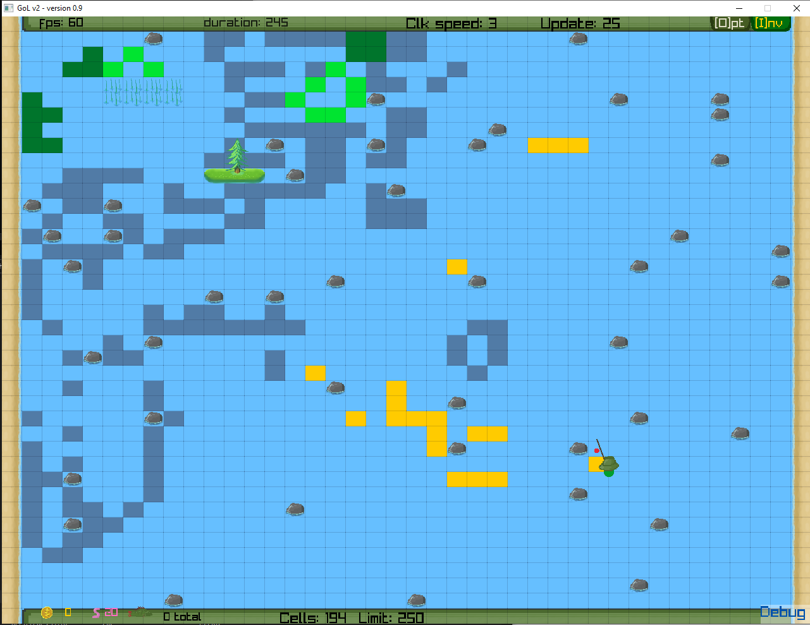

# Jontka - GoL Fishing v0.9

By: e2403299

Jontka is a fishing game based on John Conway's Game of Life cell evolution, but with a little twist.  
Your goal is to catch different kinds of fish — good luck, and tight lines!

Fish will spawn at random locations and evolve based on conditions.

    - This project is part of a software development course.

---

## Latest update (dec 1st -25)
- Option menu functionality
- Save file (records.txt) in the saves/ directory
- Tweaks to gameplay and texts
- Gameplay functions work only when menus are not open




### What we have so far:
    - You can move around as a player  
    - Use a traditional fishing pole and float to fish , have limited amount of baits
    - Baits can be purchased with coins by pressing B
    - Cells are randomly generated at 10-second intervals with the in-game clock  
    - Patterns are loaded from text files in the `example_boards` folder, but the player can choose more chaotic random generation  
    - Cell generations update three times per second, based on the in-game clock speed multiplier  
    - Different kinds of fish  
    - Inventory and options menu  
    - Change cheat codes as gamemodes in options menu
    - Save the game "records" into a file
    - Various land types and foliage  
    - Support for both Linux and Windows  

---

### DEBUG Options for Compile and Source Code
    - Actual release has a title banner and improved cosmetics  
    - Debug version shows additional rendering details  
    - In the source code `Header.h` file, `#define DEBUG` enables debug visuals by default  
    - You can change cell generation and rendering in the options menu  
    - Music can be turned off with `#define MUTEMUSIC`  

---

### Future ideas:
    - Expanding the menus and adding new features  
    - Music and sound design  
    - Instructions for compiling
    - Final release versions for Linux and Windows without source code  

---

## Linux build

You must install raylib and its dependencies first:

- [Installation guide for Linux](https://github.com/raysan5/raylib/wiki/Working-on-GNU-Linux)
- [Official site](https://www.raylib.com/)  
- [Raylib GitHub](https://github.com/raysan5/raylib)  

If you use makefile, rename makelinux to makefile!

### Compile in Linux:
```bash
gcc main.c gol_file.c render.c -o game -lraylib -lGL -lm -lpthread -ldl -lrt -lX11
